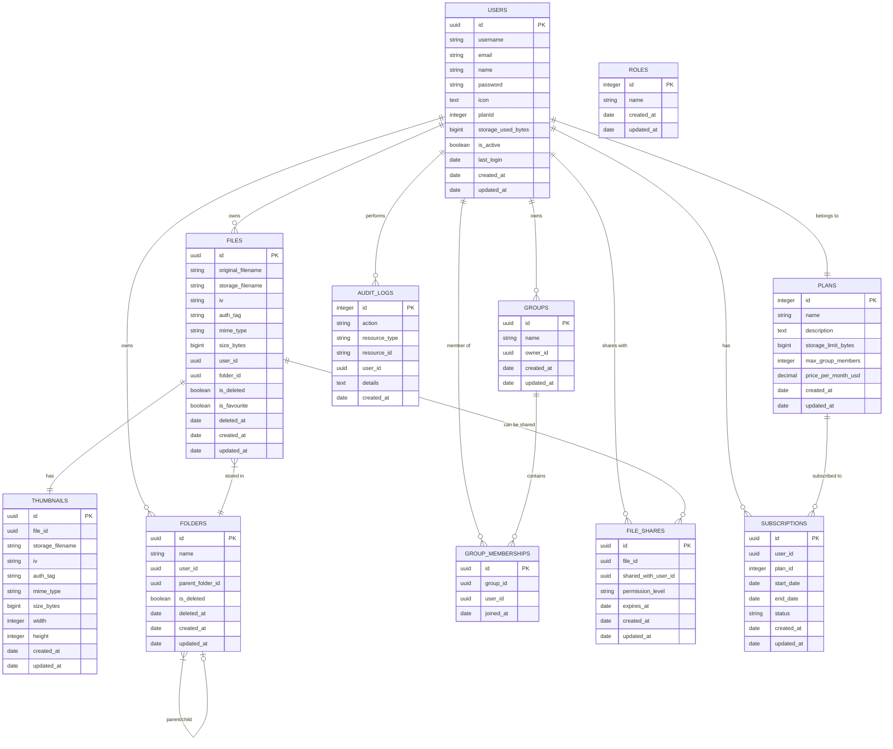

# NetDrive — Backend API

A robust Node.js backend providing secure file storage, user authentication, and media management services for the NetDrive application. Built with Express.js and PostgreSQL for scalable cloud storage solutions.

## Project Summary

NetDrive Backend is a production-ready RESTful API server deployed on DigitalOcean infrastructure that provides:
- **User Authentication** — JWT-based auth with Google OAuth integration
- **File Management** — Upload, download, organize, and share media files (currently 10MB, infrastructure supports 10GB)
- **Storage Analytics** — Real-time storage usage tracking and quotas
- **Security** — End-to-end AES-GCM encryption, SSL/TLS, and comprehensive audit logging
- **Media Processing** — Automatic thumbnail generation and video processing with FFmpeg
- **Email Services** — User verification, invitations, and notifications
- **Production Infrastructure** — PM2 process management, Nginx reverse proxy, and SSL certificates

## Tech Stack / Technologies Used

- **Runtime:** Node.js >= 18.0.0
- **Framework:** Express.js 4.18.2
- **Database:** PostgreSQL (DigitalOcean Managed Database) with Sequelize ORM 6.31.1
- **Authentication:** JWT (jsonwebtoken 9.0.0), Google Auth Library 10.3.0
- **File Upload:** Multer 2.0.2 with Sharp 0.34.4 for image processing
- **Video Processing:** Fluent-FFmpeg 2.1.3
- **Email:** Nodemailer 7.0.6 with HTML templates
- **Security:** bcryptjs 2.4.3, Helmet 8.1.0, CORS 2.8.5
- **Session Management:** cookie-session 2.0.0
- **Environment:** dotenv 17.2.3
- **Process Management:** PM2 (ecosystem.config.js)
- **Infrastructure:** DigitalOcean Droplet, Nginx reverse proxy, Certbot SSL
- **Deployment:** Production-ready with HTTPS, CSP headers, and load balancing

## Folder Structure

```
backend/
├── server.js                    # Main application entry point
├── ecosystem.config.js          # PM2 process manager configuration
├── package.json                 # Dependencies and scripts
├── .env                        # Environment variables (not in VCS)
├── ca-certificate.crt          # SSL certificate
├── uploads/                    # File storage directory
└── app/
    ├── config/                 # Application configuration
    │   ├── auth.config.js      # JWT and auth settings
    │   ├── db.config.js        # Database connection config
    │   └── initializers/
    │       └── dbInit.js       # Database initialization
    ├── controllers/            # Business logic handlers
    │   ├── auth/              # Authentication controllers
    │   │   ├── changePassword.controller.js
    │   │   ├── uploadFile.controller.js
    │   │   ├── downloadFile.controller.js
    │   │   ├── inviteUser.controller.js
    │   │   └── [other auth controllers]
    │   └── user/              # User management controllers
    ├── middleware/            # Request processing middleware
    │   ├── authJwt.js        # JWT authentication
    │   ├── upload.middleware.js # File upload handling
    │   └── validate.js       # Request validation
    ├── models/               # Database models (Sequelize)
    │   ├── user.model.js     # User accounts and profiles
    │   ├── files.model.js    # File metadata and storage
    │   ├── folder.model.js   # Folder organization
    │   ├── thumbnail.model.js # Image/video thumbnails
    │   ├── auditLog.model.js # Security and activity logs
    │   └── [other models]
    ├── routes/               # API route definitions
    │   ├── auth.routes.js    # Authentication endpoints
    │   └── user.routes.js    # User management endpoints
    ├── services/             # External service integrations
    │   ├── email.service.js  # Email sending service
    │   └── emailjs.service.js # Alternative email service
    ├── utils/                # Helper functions
    │   ├── crypto.js         # Encryption utilities
    │   ├── gcmEncryption.js  # GCM encryption implementation
    │   ├── nodemailer.js     # Email configuration
    │   └── passwordGenerator.js # Secure password generation
    └── validators/           # Input validation schemas
        └── auth/             # Authentication validators
```

## Database Schema (ER Diagram)



### Key Relationships

- **Users ↔ Plans**: Each user belongs to one plan (Basic, Premium, etc.)
- **Users ↔ Files**: Users own multiple files with encryption metadata
- **Files ↔ Thumbnails**: One-to-one relationship for media previews
- **Files ↔ Folders**: Files are organized in folder hierarchies
- **Users ↔ Groups**: Users can own and belong to multiple groups
- **Audit Logs**: Track all user actions for security and compliance

### Security Features

- **Encryption**: All files stored with AES-GCM (IV + Auth Tag)
- **Unique Constraints**: Email, username, and storage filenames
- **Audit Trail**: Complete logging of user actions
- **Soft Deletion**: Files moved to trash before permanent removal

## Installation & Setup

### Production Infrastructure Prerequisites
- **Server:** DigitalOcean Droplet (Ubuntu/CentOS recommended)
- **Database:** DigitalOcean Managed PostgreSQL Cluster
- **Domain:** Configured DNS pointing to server IP
- **SSL:** Certbot for Let's Encrypt certificates
- **Process Manager:** PM2 for application management
- **Web Server:** Nginx as reverse proxy

### Production Deployment Steps

1. **Server Setup**
   ```bash
   # Install Node.js, PM2, and Nginx
   curl -fsSL https://deb.nodesource.com/setup_18.x | sudo -E bash -
   sudo apt-get install -y nodejs nginx
   sudo npm install -g pm2
   ```

2. **Clone and Configure Application**
   ```bash
   git clone [repository-url]
   cd backend
   npm install --production
   ```

3. **Environment Configuration**
   Create production `.env` file with DigitalOcean database credentials and security keys

4. **SSL Certificate Setup**
   ```bash
   # Install Certbot and obtain SSL certificate
   sudo apt install certbot python3-certbot-nginx
   sudo certbot --nginx -d yourdomain.com -d www.yourdomain.com
   ```

5. **Nginx Configuration**
   Configure reverse proxy with SSL, CSP headers, and large file upload support
   - Frontend SPA served from `/var/www/netdrive/dist`
   - API proxied to backend on port 5000
   - Upload limit set to 10GB
   - Security headers and HTTPS redirects

6. **Process Management**
   ```bash
   # Start application with PM2
   pm2 start ecosystem.config.js --env production
   pm2 save
   pm2 startup
   ```

### Local Development Setup
For development purposes:

1. **Install dependencies**
   ```bash
   npm install
   ```

2. **Configure local environment**
   Create `.env` with local database and development settings

3. **Start development server**
   ```bash
   npm run dev  # Uses nodemon for hot reload
   ```

## Environment Variables

Create a `.env` file with the following variables:

### Database Configuration
```env
DB_HOST=your-postgres-host
DB_USER=your-db-username
DB_PASSWORD=your-db-password
DB_NAME=your-database-name
DB_PORT=your-database-naportme
```

### Security & Encryption
```env
# 64-character hex string for cookie sessions
COOKIE_SECRET=your-64-char-hex-cookie-secret

# 64-character hex string for file encryption
ENCRYPTION_KEY=your-64-char-hex-encryption-key

# JWT signing secret
JWT_SECRET=your-jwt-secret
```

### CORS & Server Configuration
```env
# Comma-separated list of allowed origins
CORS_ORIGINS=http://localhost:5173,https://yourdomain.com

# Server port (optional, defaults to 8080)
PORT=8080
```

### Google OAuth (Optional)
```env
GOOGLE_CLIENT_ID=your-google-client-id
GOOGLE_CLIENT_SECRET=your-google-client-secret
```

### Email Configuration (Optional)
```env
EMAIL_HOST=smtp.gmail.com
EMAIL_PORT=your-app-port
EMAIL_USER=your-email@gmail.com
EMAIL_PASSWORD=your-app-password
```

## Available Scripts / Commands

```powershell
# Install dependencies
npm install

# Start production server
npm start

# Start development server with hot reload
npm run dev

# Run tests (if configured)
npm test
```

## API Endpoints

### Authentication Endpoints
| Method | Endpoint | Description |
|--------|----------|-------------|
| POST | `/api/auth/signup` | Register new user |
| POST | `/api/auth/signin` | User login |
| POST | `/api/auth/signout` | User logout |
| GET | `/api/auth/me` | Get current user info |
| POST | `/api/auth/change-password` | Change user password |
| POST | `/api/auth/google` | Google OAuth login |
| POST | `/api/auth/invite` | Invite new user (admin) |

### File Management Endpoints
| Method | Endpoint | Description |
|--------|----------|-------------|
| POST | `/api/auth/upload` | Upload files (multipart) |
| GET | `/api/auth/file/:id` | Download/stream file |
| GET | `/api/auth/files` | List user files |
| GET | `/api/auth/download-thumbnail/:id` | Get file thumbnail |
| DELETE | `/api/auth/file/:id` | Soft delete file |
| DELETE | `/api/auth/file/:id/permanent` | Permanently delete file |
| POST | `/api/auth/file/:id/restore` | Restore deleted file |
| POST | `/api/auth/file/:id/favorite` | Toggle favorite status |

### User & Storage Endpoints
| Method | Endpoint | Description |
|--------|----------|-------------|
| GET | `/api/auth/user/storage-stats` | Get storage usage stats |
| GET | `/api/auth/user/favorites` | Get favorited files |
| GET | `/api/auth/user/trash` | Get deleted files |
| GET | `/api/user/plans` | Get available plans |
| GET | `/api/user/roles` | Get user roles |

## Core Backend Concepts

### 1. Authentication & Security
- **JWT Tokens** — Stateless authentication with secure token signing
- **Cookie Sessions** — Persistent sessions with httpOnly, secure cookies
- **CORS Protection** — Configurable origin allowlist for cross-origin requests
- **Input Validation** — Comprehensive request validation with custom validators
- **Password Hashing** — bcrypt for secure password storage

### 2. File Upload & Processing
- **Multipart Upload** — Handles large file uploads with progress tracking
- **File Validation** — MIME type validation and size limits
- **Thumbnail Generation** — Automatic thumbnail creation with Sharp
- **Video Processing** — FFmpeg integration for video thumbnails
- **Encryption** — AES-GCM encryption for stored files
- **Storage Management** — Organized file storage with metadata tracking

### 3. Database Architecture
- **Sequelize ORM** — PostgreSQL integration with model relationships
- **Auto-initialization** — Database and tables created on first run
- **Audit Logging** — Comprehensive activity tracking
- **Soft Deletion** — Files moved to trash before permanent deletion
- **User Plans** — Storage quotas and feature restrictions

### 4. Email Services
- **User Verification** — Email confirmation for new accounts
- **Password Reset** — Secure password recovery workflow
- **User Invitations** — Admin-initiated user invitations
- **HTML Templates** — Styled email templates for notifications

## Production Deployment & Infrastructure

### Current Production Setup
NetDrive is deployed on DigitalOcean infrastructure with enterprise-grade security and performance:

- **Server:** DigitalOcean Droplet with Ubuntu
- **Database:** DigitalOcean Managed PostgreSQL Cluster
- **Process Management:** PM2 for zero-downtime deployments
- **Web Server:** Nginx reverse proxy with SSL termination
- **SSL/TLS:** Let's Encrypt certificates via Certbot
- **Domain:** Production domain with HTTPS-only access
- **File Storage:** Encrypted local storage with 10GB upload support

### Nginx Configuration Features
- **SSL Termination:** Automatic HTTPS redirect and SSL certificate management
- **Content Security Policy:** Strict CSP headers for XSS protection
- **Large File Uploads:** 10GB maximum file size support
- **Static File Serving:** Direct serving of frontend SPA
- **API Proxying:** Seamless backend API integration
- **Security Headers:** Comprehensive security header configuration

### PM2 Process Management
```bash
# Production deployment commands
pm2 start ecosystem.config.js --env production
pm2 reload backend-app  # Zero-downtime reload
pm2 monit              # Real-time monitoring
pm2 logs               # Application logs
pm2 restart all        # Restart all processes
```

### SSL Certificate Management
```bash
# Automatic certificate renewal
sudo certbot renew --dry-run
# Certificates auto-renew via cron job
```

### Database Management
- **DigitalOcean PostgreSQL Cluster:** Managed database with automatic backups
- **Connection Pooling:** Optimized connection management
- **SSL Connections:** Encrypted database communication
- **Automated Backups:** Daily backups with point-in-time recovery

## Security Considerations

### File Security
- All uploaded files are encrypted at rest using AES-GCM
- File access is authenticated and authorized per user
- Thumbnails are generated server-side to prevent client-side attacks
- MIME type validation prevents malicious file uploads

### API Security
- Rate limiting on authentication endpoints
- CSRF protection with SameSite cookies
- SQL injection prevention with Sequelize ORM
- XSS protection with input sanitization

## Known Issues / Future Improvements

### Current Limitations
- **File Upload Size** — Currently limited to 10MB (server infrastructure configured for 10GB)
- Single server deployment (no horizontal scaling)
- Local file storage only (no cloud storage integration)
- Limited video processing capabilities
- Email templates are basic HTML

### Planned Features
- **File Size Scaling** — Increase upload limit from 10MB to full 10GB infrastructure capacity
- AWS S3/Google Cloud Storage integration
- Advanced video transcoding pipeline
- Real-time notifications with WebSocket
- Advanced user roles and permissions
- API rate limiting and caching
- Automated backup and disaster recovery

## Contributing

### Development Guidelines
1. Follow ES6+ JavaScript standards
2. Use async/await for asynchronous operations
3. Implement proper error handling and logging
4. Write comprehensive input validation
5. Add audit logging for sensitive operations
6. Maintain database migrations for schema changes

### Testing
```powershell
# Run unit tests (when implemented)
npm test

# Run integration tests
npm run test:integration

# Run linting
npm run lint
```

## License

This project is licensed under the ISC License.

## Env variables (examples)
The project may use env variables; confirm these in `app/config` and `server.js`. Typical ones include:
- `PORT` — server port
- `DATABASE_URL` or DB host/credentials — for the database
- `JWT_SECRET` or other auth secrets
- Storage credentials (e.g., `S3_BUCKET`, `S3_KEY`, `S3_SECRET`) if used

Do not commit secrets. Provide `.env.example` for contributor convenience.

## Running locally (PowerShell)
From the `backend` folder:

```powershell
# install
npm install

# start dev server (use your package.json script, common ones are)
npm run start
# or
node server.js

# If using PM2 for production (ecosystem.config.js present)
pm install -g pm2
pm2 start ecosystem.config.js
```

## TLS / certificates
- `ca-certificate.crt` may be present for outgoing/incoming TLS depending on the deployment. Confirm usage in `server.js` or config files.

## Troubleshooting
- If uploads fail: check server logs for validation errors (type/size), disk space, permissions, and thumbnail generation errors.
- If session check fails: verify cookies are being set with the response and that the frontend requests use credentials: 'include'.
- If CORS errors occur: confirm backend `Access-Control-Allow-Origin` and `Access-Control-Allow-Credentials` headers.

## Developer notes
- If you change response shapes for uploads or storage stats, update the frontend normalization code (see `frontend/src/components/Gallery/GalleryUpload.tsx`).
- When adding new endpoints, update `routes` and controller files, and ensure the endpoint is documented here so the frontend can use it.

## Next improvements
- Add OpenAPI / Swagger docs for the API so frontend developers can inspect schema and response shapes.
- Add integration tests for upload flows and storage aggregation.

---
If you'd like, I can scan the backend router files and generate an endpoint list with exact parameter names and sample responses.
